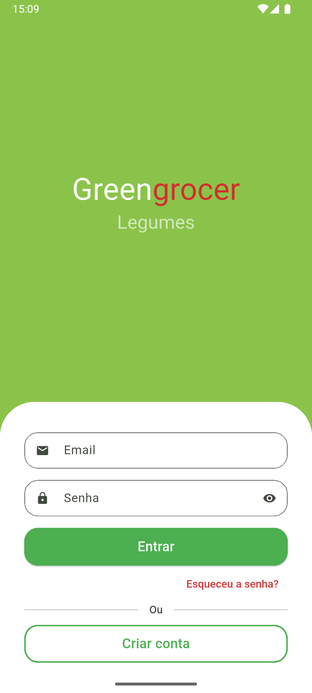
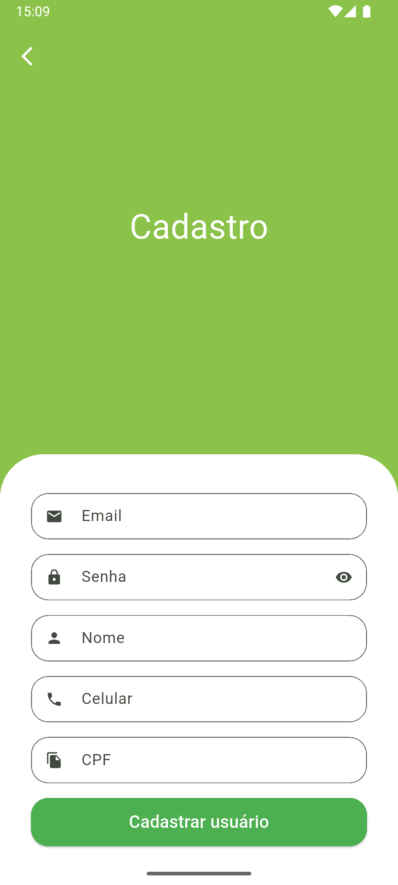
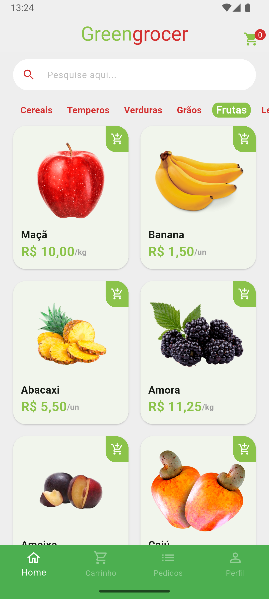
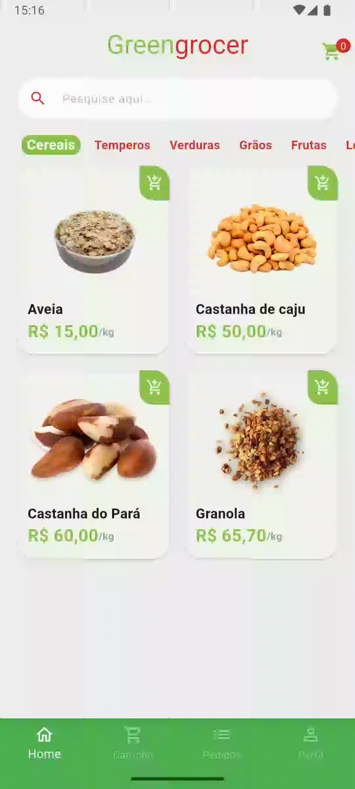
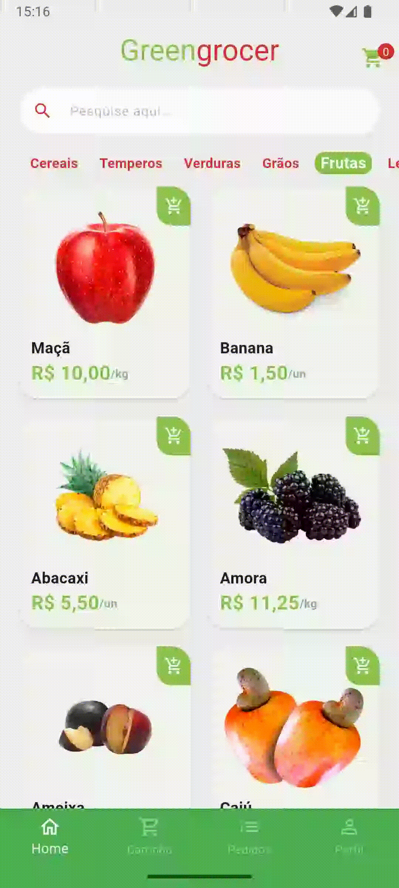
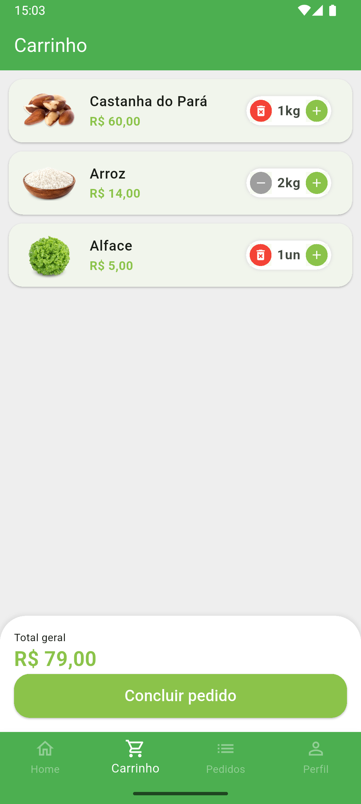
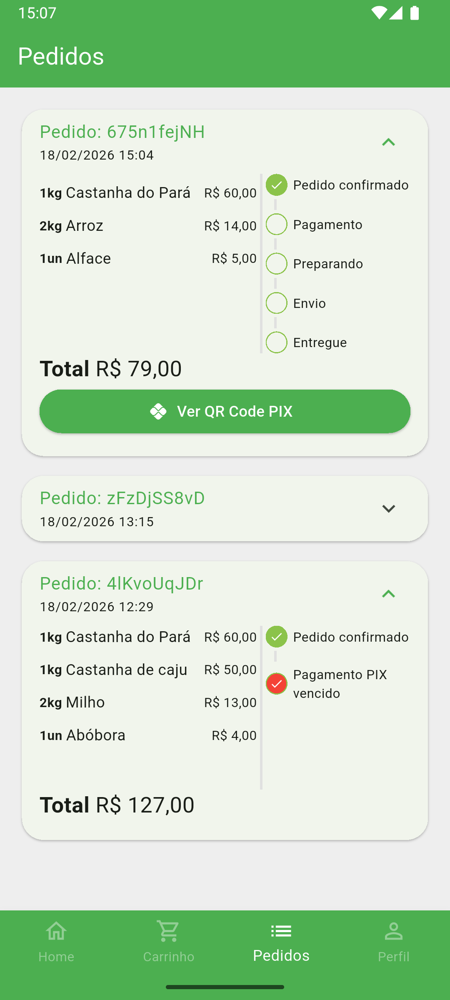
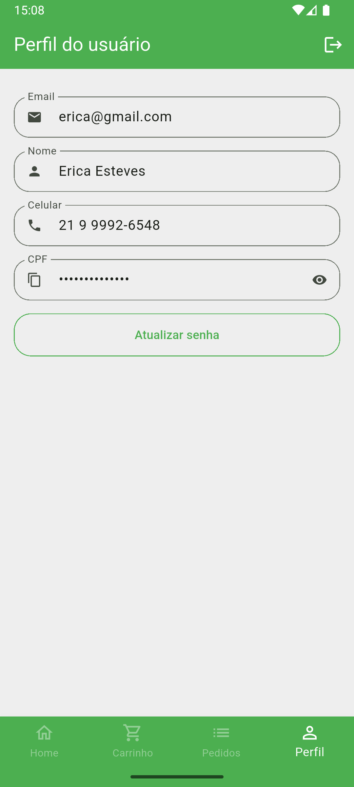

# 🛒 Greengrocer - Flutter

Um aplicativo de hortifruti completo desenvolvido em Flutter, permitindo que os usuários naveguem por categorias de produtos, gerenciem seu carrinho de compras e realizem pedidos com acompanhamento em tempo real.

## 📌 Tecnologias Utilizadas

- **Flutter + Dart**
- **GetX** (Gerenciamento de estado, rotas e dependências)
- **Dio** (Requisições HTTP)
- **Back4App / Parse Server** (Backend as a Service)
- **Freezed & JSON Serializable** (Geração de modelos de dados imutáveis)
- **Shimmer** (Efeitos de loading skeleton)
- **Custom Animations** (Splash screen animada e animações de feedback visual)

## 🚀 Como Executar

1. **Clone o repositório:**

   ```sh
   git clone https://github.com/erizoka/greengrocer
   cd greengrocer
   ```

2. **Instale as dependências:**

   ```sh
    flutter pub get
   ```

3. **Gere os arquivos do build_runner (Modelos):**

   ```sh
    dart run build_runner build
   ```

4. **Execute o app:**

   ```sh
    flutter run
   ```

## 🔍 Funcionalidades

- **Autenticação**: Fluxo completo de Login, Cadastro e Recuperação de Senha.
- **Catálogo de Itens**: Navegação por categorias com busca dinâmica de produtos.
- **Carrinho de Compras**: Gerenciamento de itens, ajuste de quantidades e cálculo total automático.
- **Pedidos**: Histórico detalhado de compras com status de entrega e QR Code de pagamento.
- **Perfil**: Gerenciamento de dados do usuário e alteração de senha segura.
- **UX/UI**: Interface moderna com animações de transição, feedbacks visuais (Toasts) e máscaras de entrada.

## 📷 Capturas de Tela

### Autenticação e Home
<p>
  
  
  
</p>

### Navegação e Busca
<p>
  
  
  
</p>

### Carrinho e Pedidos
<p>
  
  
  
</p>

## 📄 Licença

Este projeto está sob a licença MIT. Veja o arquivo [LICENSE](LICENSE) para mais detalhes.

---

Desenvolvido por [Erica Esteves](https://github.com/erizoka). 🚀
